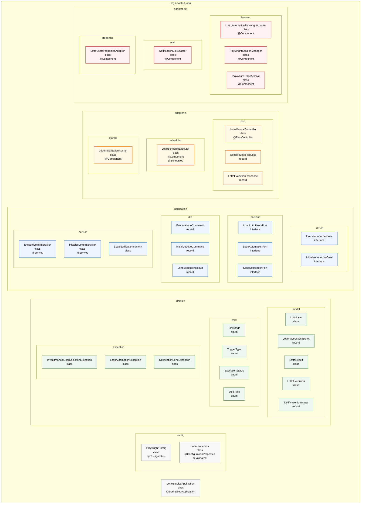
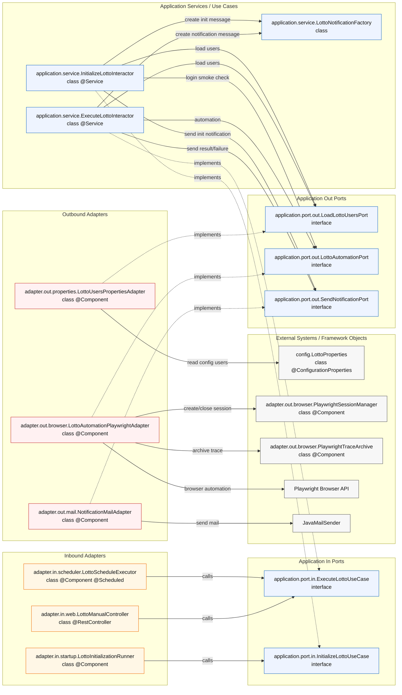

# Lotto Service Clean Architecture Blueprint

히스토리 저장/조회 기능을 제외한, Playwright 자동화와 메일 발송 중심의 일반적인 Spring 기반 클린 아키텍처 구조안이다.

## Package Tree

```text
org.nowstart.lotto
├─ LottoServiceApplication                            [class, @SpringBootApplication]
├─ config
│  ├─ PlaywrightConfig                                [class, @Configuration]
│  └─ LottoProperties                                 [class, @ConfigurationProperties, @Validated]
├─ domain
│  ├─ model
│  │  ├─ LottoUser                                    [class]
│  │  ├─ LottoAccountSnapshot                         [record]
│  │  ├─ LottoResult                                  [class]
│  │  ├─ LottoExecution                               [class]
│  │  └─ NotificationMessage                          [record]
│  ├─ type
│  │  ├─ TaskMode                                     [enum]
│  │  ├─ TriggerType                                  [enum]
│  │  ├─ ExecutionStatus                              [enum]
│  │  └─ StepType                                     [enum]
│  └─ exception
│     ├─ InvalidManualUserSelectionException          [class]
│     ├─ LottoAutomationException                     [class]
│     └─ NotificationSendException                    [class]
├─ application
│  ├─ port
│  │  ├─ in
│  │  │  ├─ ExecuteLottoUseCase                       [interface]
│  │  │  └─ InitializeLottoUseCase                    [interface]
│  │  └─ out
│  │     ├─ LoadLottoUsersPort                        [interface]
│  │     ├─ LottoAutomationPort                       [interface]
│  │     └─ SendNotificationPort                      [interface]
│  ├─ dto
│  │  ├─ ExecuteLottoCommand                          [record]
│  │  ├─ InitializeLottoCommand                       [record]
│  │  └─ LottoExecutionResult                         [record]
│  └─ service
│     ├─ ExecuteLottoInteractor                       [class, @Service]
│     ├─ InitializeLottoInteractor                    [class, @Service]
│     └─ LottoNotificationFactory                     [class]
└─ adapter
   ├─ in
   │  ├─ web
   │  │  ├─ LottoManualController                     [class, @RestController]
   │  │  ├─ request
   │  │  │  └─ ExecuteLottoRequest                    [record]
   │  │  └─ response
   │  │     └─ LottoExecutionResponse                 [record]
   │  ├─ scheduler
   │  │  └─ LottoScheduleExecutor                     [class, @Component, @Scheduled]
   │  └─ startup
   │     └─ LottoInitializationRunner                 [class, @Component]
   └─ out
      ├─ browser
      │  ├─ LottoAutomationPlaywrightAdapter          [class, @Component]
      │  ├─ PlaywrightSessionManager                  [class, @Component]
      │  └─ PlaywrightTraceArchive                    [class, @Component]
      ├─ mail
      │  └─ NotificationMailAdapter                   [class, @Component]
      └─ properties
         └─ LottoUsersPropertiesAdapter               [class, @Component]
```

## Layer Overview



## Dependency Diagram



## Annotation Rules

| Package | Main Types | Spring / JPA Annotation Rule |
| --- | --- | --- |
| `org.nowstart.lotto.config` | config class | `@Configuration`, `@Bean`, `@ConfigurationProperties`, `@Validated` |
| `org.nowstart.lotto.domain.*` | model, enum, exception | annotation 없음 |
| `org.nowstart.lotto.application.port.*` | interface | annotation 없음 |
| `org.nowstart.lotto.application.dto` | command/result | annotation 없음 |
| `org.nowstart.lotto.application.service` | use case class | `@Service` 만 허용, `@Transactional` 없음 |
| `org.nowstart.lotto.adapter.in.web` | controller | `@RestController`, MVC mapping annotations |
| `org.nowstart.lotto.adapter.in.scheduler` | scheduler | `@Component`, `@Scheduled` |
| `org.nowstart.lotto.adapter.in.startup` | startup runner | `@Component` |
| `org.nowstart.lotto.adapter.out.browser` | Playwright adapter | `@Component` |
| `org.nowstart.lotto.adapter.out.mail` | mail adapter | `@Component` |
| `org.nowstart.lotto.adapter.out.properties` | properties adapter | `@Component` |

## Transaction Boundary

- 현재 구조에는 히스토리 저장/조회가 없으므로 DB 트랜잭션 경계가 없다.
- Playwright 로그인/구매/조회와 메일 발송은 모두 외부 I/O 이므로 `@Transactional` 대상이 아니다.
- 나중에 실행 이력 저장이 추가되면 그때 별도 persistence adapter 와 record service 를 추가하고, 짧은 저장 메서드에만 `@Transactional` 을 둔다.
