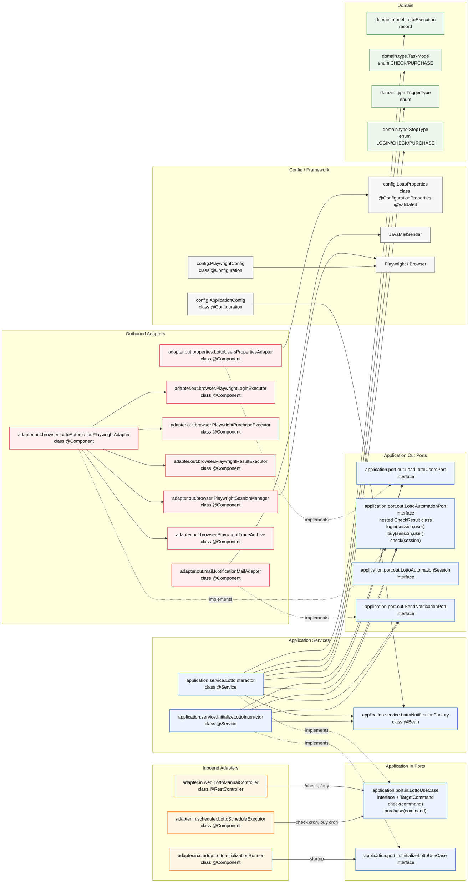

# Lotto Service Clean Architecture

현재 코드는 `application/service` 를 단순하게 유지하는 방향으로 정리되어 있다.

- 퍼블릭 유즈케이스: `check`, `purchase`
- 내부 자동화 step: `login`, `check`, `buy`
- 공통 실행 로직은 별도 service 파일로 분리하지 않고 `LottoInteractor` 내부 private 메서드로 둔다

## Package Tree

```text
org.nowstart.lotto
├─ LottoServiceApplication                                        [class, @SpringBootApplication]
├─ config
│  ├─ ApplicationConfig                                           [class, @Configuration]
│  ├─ LottoProperties                                             [class, @ConfigurationProperties, @Validated]
│  ├─ PlaywrightConfig                                            [class, @Configuration]
│  └─ SwaggerConfig                                               [class, @Configuration]
├─ domain
│  ├─ model
│  │  ├─ LottoUser                                                [record]
│  │  ├─ LottoAccountSnapshot                                     [record]
│  │  ├─ LottoResult                                              [record]
│  │  ├─ LottoExecution                                           [record]
│  │  └─ NotificationMessage                                      [record]
│  ├─ type
│  │  ├─ ExecutionStatus                                          [enum]
│  │  ├─ MessageType                                              [enum]
│  │  ├─ StepType                                                 [enum]
│  │  ├─ TaskMode                                                 [enum: CHECK, PURCHASE]
│  │  └─ TriggerType                                              [enum]
│  └─ exception
│     ├─ InvalidManualUserSelectionException                      [class]
│     ├─ LottoAutomationException                                 [class]
│     └─ NotificationSendException                                [class]
├─ application
│  ├─ port
│  │  ├─ in
│  │  │  ├─ LottoUseCase                                          [interface + TargetCommand]
│  │  │  └─ InitializeLottoUseCase                                [interface, initialize()]
│  │  └─ out
│  │     ├─ LoadLottoUsersPort                                    [interface]
│  │     ├─ LottoAutomationPort                                   [interface + CheckResult]
│  │     ├─ LottoAutomationSession                                [interface]
│  │     └─ SendNotificationPort                                  [interface]
│  └─ service
│     ├─ InitializeLottoInteractor                                [class, @Service]
│     ├─ LottoInteractor                                          [class, @Service]
│     └─ LottoNotificationFactory                                 [class, no annotation, @Bean 등록]
└─ adapter
   ├─ in
   │  ├─ scheduler
   │  │  └─ LottoScheduleExecutor                                 [class, @Component]
   │  ├─ startup
   │  │  └─ LottoInitializationRunner                             [class, @Component]
   │  └─ web
   │     ├─ LottoManualController                                 [class, @RestController]
   │     └─ response
   │        ├─ LottoExecutionResponse                             [record]
   │        └─ ManualExecutionErrorResponse                       [record]
   └─ out
      ├─ browser
      │  ├─ LottoAutomationPlaywrightAdapter                      [class, @Component]
      │  ├─ LottoBrowserConstants                                 [class]
      │  ├─ PlaywrightLoginExecutor                               [class, @Component]
      │  ├─ PlaywrightPurchaseExecutor                            [class, @Component]
      │  ├─ PlaywrightResultExecutor                              [class, @Component]
      │  ├─ PlaywrightSessionManager                              [class, @Component]
      │  └─ PlaywrightTraceArchive                                [class, @Component]
      ├─ mail
      │  └─ NotificationMailAdapter                               [class, @Component]
      └─ properties
         └─ LottoUsersPropertiesAdapter                           [class, @Component]
```

## Dependency Diagram



## 핵심 구조

```text
Controller / Scheduler (Adapter In)
  -> LottoUseCase.check(...) / LottoUseCase.purchase(...)
    <- LottoInteractor
      -> LoadLottoUsersPort
      -> LottoAutomationPort
      -> SendNotificationPort
        <- PropertiesAdapter / PlaywrightAdapter / MailAdapter
```

즉:

- 어댑터가 `check` 와 `purchase` 중 무엇을 호출할지 결정
- `LottoInteractor` 가 유저 선택, 배치 실행, step 호출, 알림 처리까지 담당
- `login`, `check`, `buy` 는 내부 자동화 step 으로만 사용

추가로 `purchase` 는 내부적으로 `login -> buy -> check` 순서로 동작하며, 구매 후 조회된 최신 로또 번호를 메일로 전달한다.
`LottoResult` 는 순수 결과 값만 들고, 스크린샷은 `application.port.out.LottoAutomationPort.CheckResult` 내부로 한정되어 메일 생성에만 사용한다.

## Spring Annotation Rules

| Package | 포함 가능 | 포함하지 않음 |
| --- | --- | --- |
| `org.nowstart.lotto.config` | `@Configuration`, `@Bean`, `@ConfigurationProperties`, `@Validated` | `@RestController`, `@Entity` |
| `org.nowstart.lotto.domain.*` | 없음 | 모든 Spring annotation, `@Transactional`, JPA annotation |
| `org.nowstart.lotto.application.port.*` | 없음 | 모든 Spring annotation |
| `org.nowstart.lotto.application.service` | `@Service` | `@RestController`, `@Repository`, JPA annotation |
| `org.nowstart.lotto.adapter.in.web` | `@RestController`, `@RequestMapping`, `@PostMapping`, `@ExceptionHandler` | `@Service`, `@Repository` |
| `org.nowstart.lotto.adapter.in.scheduler` | `@Component`, `@Scheduled` | `@RestController`, `@Repository` |
| `org.nowstart.lotto.adapter.in.startup` | `@Component` | `@RestController`, `@Repository` |
| `org.nowstart.lotto.adapter.out.browser` | `@Component` | `@RestController`, JPA annotation |
| `org.nowstart.lotto.adapter.out.mail` | `@Component` | `@RestController`, JPA annotation |
| `org.nowstart.lotto.adapter.out.properties` | `@Component` | `@RestController`, JPA annotation |

## Transaction Boundary

- 현재 구조에는 DB 저장이 없으므로 `@Transactional` 경계가 없다.
- Playwright 자동화와 메일 발송은 외부 I/O 이고, 하나의 ACID 트랜잭션으로 묶을 대상이 아니다.
- 나중에 DB 저장이 생기면:
  - `application.port.out` 에 저장 포트를 추가하고
  - `adapter.out.persistence` 에 구현체를 두고
  - 실제 DB write 를 수행하는 애플리케이션 서비스 경계에만 `@Transactional` 을 둔다.
